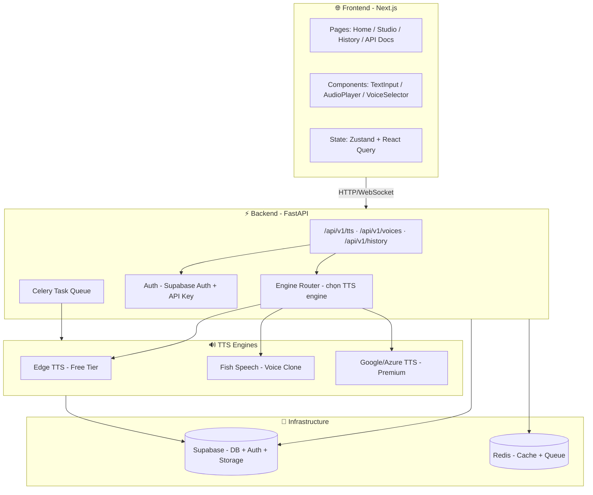
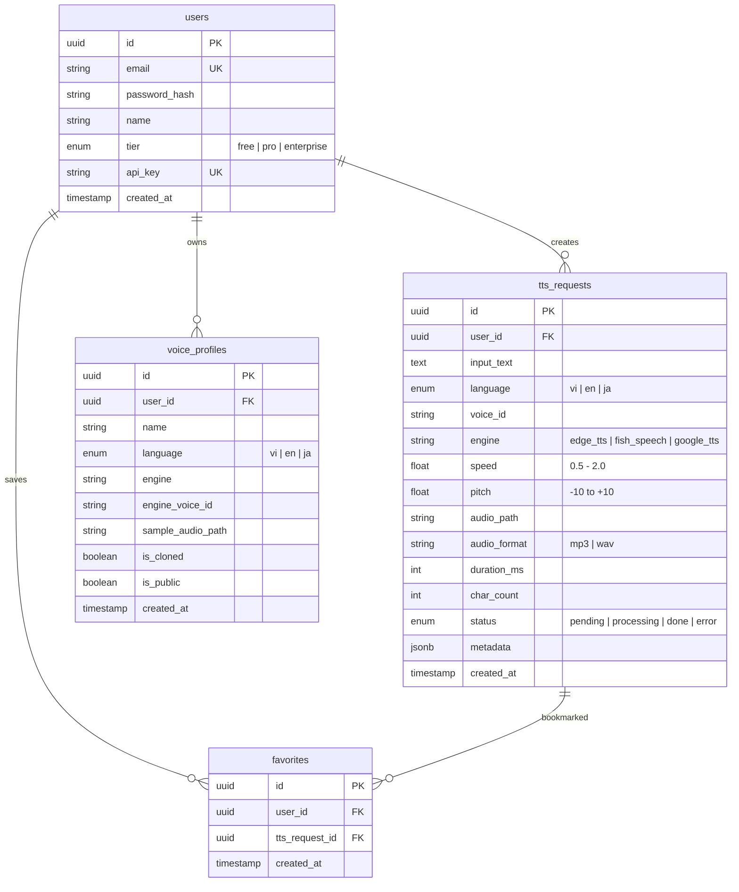

# 📋 Implementation Plan: VoiceSensei — TTS Language Teaching Platform

> **Approach:** Hybrid (Option C) — Open-source models + Cloud API tier
> **Stack:** Python FastAPI + Next.js + Supabase + Redis
> **Languages:** 🇻🇳 Vietnamese · 🇬🇧 English
>
> **Thay đổi so với plan gốc:**
> - ❌ Bỏ Bảng giá (Pricing section)
> - ❌ Ẩn Tính năng nổi bật (Features section)
> - ❌ Ẩn API nav link (vẫn có endpoint, ẩn trên UI)
> - ❌ Bỏ Batch processing page
> - ❌ Ẩn Japanese (ja) — chỉ hỗ trợ VI + EN

---

## Tổng quan kiến trúc



---

## Cấu trúc project

```
tts/
├── backend/                     # FastAPI Backend
│   ├── app/
│   │   ├── main.py              # FastAPI app entry
│   │   ├── config.py            # Settings (Pydantic)
│   │   ├── api/
│   │   │   ├── v1/
│   │   │   │   ├── tts.py       # POST /tts, GET /tts/{id}
│   │   │   │   ├── voices.py    # GET /voices
│   │   │   │   ├── history.py   # GET/DELETE /history
│   │   │   │   └── auth.py      # Supabase Auth, API keys
│   │   ├── engines/             # TTS Engine Abstraction
│   │   │   ├── base.py          # Abstract TTSEngine class
│   │   │   ├── edge_tts.py      # Edge TTS (Free)
│   │   │   ├── fish_speech.py   # Fish Speech (Voice Clone)
│   │   │   ├── google_tts.py    # Google Cloud TTS
│   │   │   └── router.py        # Engine selection logic
│   │   ├── models/              # Pydantic models (Supabase)
│   │   │   ├── user.py
│   │   │   ├── tts_request.py
│   │   │   └── voice_profile.py
│   │   ├── schemas/             # Pydantic schemas
│   │   ├── services/            # Business logic
│   │   ├── tasks/               # Celery async tasks
│   │   └── utils/               # Audio processing helpers
│   ├── tests/
│   ├── supabase/                # Supabase migrations + seed
│   ├── requirements.txt
│   └── Dockerfile
│
├── frontend/                    # Next.js Frontend
│   ├── src/
│   │   ├── app/
│   │   │   ├── page.tsx         # Landing page
│   │   │   ├── studio/          # TTS Studio (main workspace)
│   │   │   ├── history/         # Conversion history
│   │   │   ├── voices/          # Voice gallery
│   │   │   └── api-docs/        # Public API documentation
│   │   ├── components/
│   │   │   ├── TextInput.tsx     # Rich text input
│   │   │   ├── AudioPlayer.tsx   # Waveform player + controls
│   │   │   ├── VoiceSelector.tsx # Voice picker UI
│   │   │   ├── SpeedControl.tsx  # Speed/Pitch sliders
│   │   │   └── WordHighlight.tsx # Karaoke-style highlight
│   │   ├── hooks/
│   │   ├── lib/                 # API client, utils
│   │   └── stores/              # Zustand stores
│   ├── public/
│   ├── package.json
│   └── Dockerfile
│
├── docker-compose.yml           # Full stack orchestration
├── .env.example
└── README.md
```

---

## Database Schema (Supabase PostgreSQL)



---

## API Endpoints

### Core TTS API

| Method | Endpoint | Mô tả | Auth |
|--------|----------|-------|------|
| `POST` | `/api/v1/tts` | Chuyển text → speech | Supabase JWT / API Key |
| `GET` | `/api/v1/tts/{id}` | Lấy kết quả TTS (audio URL) | Supabase JWT / API Key |
| `POST` | `/api/v1/tts/stream` | Stream audio realtime (WebSocket) | Supabase JWT |

**Request body `POST /api/v1/tts`:**

```json
{
  "text": "Xin chào, tôi là VoiceSensei",
  "language": "vi",
  "voice_id": "vi-female-01",
  "speed": 0.8,
  "pitch": 0,
  "format": "mp3",
  "engine": "auto"
}
```

**Response:**

```json
{
  "id": "uuid",
  "status": "done",
  "audio_url": "/audio/uuid.mp3",
  "duration_ms": 3200,
  "char_count": 28,
  "engine_used": "edge_tts",
  "word_timestamps": [
    { "word": "Xin", "start": 0, "end": 320 },
    { "word": "chào", "start": 320, "end": 650 }
  ]
}
```

### Voice Management

| Method | Endpoint | Mô tả |
|--------|----------|-------|
| `GET` | `/api/v1/voices` | Danh sách giọng (filter by language) |
| `POST` | `/api/v1/voices/clone` | Upload audio → clone voice |
| `GET` | `/api/v1/voices/{id}/sample` | Nghe mẫu giọng |

### User & History

| Method | Endpoint | Mô tả |
|--------|----------|-------|
| `GET` | `/api/v1/history` | Lịch sử TTS (paginated) |
| `DELETE` | `/api/v1/history/{id}` | Xóa 1 record |
| `POST` | `/api/v1/favorites/{tts_id}` | Thêm vào yêu thích |

---

## Engine Abstraction Pattern

```python
# backend/app/engines/base.py
from abc import ABC, abstractmethod
from dataclasses import dataclass

@dataclass
class TTSResult:
    audio_path: str
    duration_ms: int
    format: str
    word_timestamps: list[dict] | None = None

class TTSEngine(ABC):
    @abstractmethod
    async def synthesize(
        self,
        text: str,
        language: str,
        voice_id: str,
        speed: float = 1.0,
        pitch: float = 0,
        output_format: str = "mp3",
    ) -> TTSResult:
        ...

    @abstractmethod
    async def list_voices(self, language: str | None = None) -> list[dict]:
        ...

    @abstractmethod
    def supports_voice_cloning(self) -> bool:
        ...
```

```python
# backend/app/engines/router.py
class EngineRouter:
    """Chọn engine dựa trên user tier + request."""

    def select(self, user_tier: str, engine_pref: str, language: str) -> TTSEngine:
        if engine_pref != "auto":
            return self._get_engine(engine_pref)

        match user_tier:
            case "free":
                return EdgeTTSEngine()
            case "pro":
                return FishSpeechEngine()
            case "enterprise":
                return GoogleTTSEngine()
```

---

## Phases Chi Tiết

### Phase 1: Foundation (Tuần 1-2) 🏗️

> Setup project, core TTS flow hoạt động end-to-end.

| Task | Files | Chi tiết |
|------|-------|----------|
| Init FastAPI project | `backend/` | Cấu trúc, config, Docker |
| Init Next.js project | `frontend/` | App Router, Tailwind, layout |
| Supabase setup | `supabase/` | Project init, tables, RLS policies |
| Supabase Storage | bucket `audio` | Lưu audio files, signed URLs |
| Edge TTS engine | `engines/edge_tts.py` | Integrate `edge-tts` library |
| Engine abstraction | `engines/base.py, router.py` | Abstract class + router |
| Core API: `POST /tts` | `api/v1/tts.py` | Text → Audio pipeline |
| Basic Frontend Studio | `studio/page.tsx` | TextInput + VoiceSelector + AudioPlayer |
| Docker Compose | `docker-compose.yml` | Backend + Frontend + Redis |

**Kết quả Phase 1:** Nhập text → chọn ngôn ngữ → nhấn nút → nghe audio.

---

### Phase 2: Language Teaching Features (Tuần 3-4) 📚

> Thêm tính năng dành riêng cho dạy ngôn ngữ.

| Task | Files | Chi tiết |
|------|-------|----------|
| Speed control (0.5x-2x) | `SpeedControl.tsx`, engine update | Slider UI + engine parameter |
| Pitch control | `PitchControl.tsx` | Giọng cao/thấp cho luyện nghe |
| Multi-voice UI | `VoiceSelector.tsx` | Gallery giọng nam/nữ cho VI/EN/JA |
| User auth (Supabase) | `api/v1/auth.py` + frontend | Supabase Auth (email, OAuth) |
| History page | `history/`, `api/v1/history.py` | Danh sách + replay + delete |
| Favorites | `favorites table` | Bookmark câu hay |
| Pronunciation guide | `PronunciationGuide.tsx` | Hiện IPA/romaji/pinyin bên cạnh text |
| Audio download | Frontend button | Download MP3/WAV |

**Kết quả Phase 2:** Trải nghiệm hoàn chỉnh cho học sinh: nghe chậm, xem phiên âm, lưu lại.

---

### Phase 3: Advanced TTS (Tuần 5-7) 🔊

> Tích hợp model mạnh hơn, voice cloning.

| Task | Files | Chi tiết |
|------|-------|----------|
| Fish Speech integration | `engines/fish_speech.py` | Setup model, inference API |
| Voice cloning UI | `voices/clone/page.tsx` | Upload audio → create voice |
| Voice gallery | `voices/page.tsx` | Browse + preview voices |
| Celery task queue | `tasks/tts_task.py` | Async TTS cho model nặng |
| Audio caching (Redis) | `services/cache.py` | Cache kết quả trùng text+voice |
| Rate limiting | middleware | Free: 50 req/ngày, Pro: unlimited |
| User tiers | `models/user.py` | Free / Pro / Enterprise |

**Kết quả Phase 3:** Giáo viên clone giọng mình, học sinh nghe giọng thầy/cô đọc mọi text.

---

### Phase 4: Interactive Learning (Tuần 8-9) 🎯

> Tính năng tương tác nâng cao.

| Task | Files | Chi tiết |
|------|-------|----------|
| Word highlighting | `WordHighlight.tsx` | Karaoke-style sync text + audio |
| Word timestamps API | Engine update | Extract timing từ TTS output |
| Batch processing | `api/v1/tts.py` + UI | Upload file → bulk convert |
| Sentence comparison | `SpeechCompare.tsx` | Record user voice → so sánh phát âm |
| Audio waveform | `AudioPlayer.tsx` | Visualize waveform (WaveSurfer.js) |

**Kết quả Phase 4:** Trải nghiệm tương tác: highlight từ, so sánh phát âm, batch convert.

---

### Phase 5: API & Scale (Tuần 10-11) 🚀

> Public API, cloud tier, production deployment.

| Task | Files | Chi tiết |
|------|-------|----------|
| API key management | `api/v1/auth.py` | Generate/revoke API keys |
| Public API docs | `api-docs/page.tsx` | Interactive Swagger-style docs |
| Google Cloud TTS engine | `engines/google_tts.py` | Enterprise tier |
| Usage tracking | `models/usage.py` | Char count per day/month |
| Landing page | `page.tsx` | Marketing page + demo |
| Production Docker | `Dockerfile`, CI/CD | Multi-stage build, nginx |

**Kết quả Phase 5:** Platform hoàn chỉnh: web app + public API + tiering.

---

## Verification Plan

### Automated Tests

```bash
# Backend unit tests
cd backend && pytest tests/ -v

# Test TTS engine abstraction
pytest tests/engines/ -v

# Test API endpoints
pytest tests/api/ -v

# Frontend lint + type check
cd frontend && npm run lint && npx tsc --noEmit
```

### Manual Verification (mỗi phase)

| Phase | Kiểm tra | Cách test |
|-------|----------|-----------|
| **1** | Nhập text tiếng Việt → nhấn Play → nghe audio | Mở `http://localhost:3000/studio` |
| **1** | Đổi ngôn ngữ sang EN/JA → audio đúng ngôn ngữ | Chọn dropdown ngôn ngữ |
| **2** | Kéo slider speed = 0.5x → audio chậm hơn | So sánh thời lượng audio |
| **2** | Đăng ký → Login → xem history | Flow auth hoàn chỉnh |
| **3** | Upload file audio 10s → clone voice → generate text mới | Voice cloning flow |
| **3** | Free user bị giới hạn 50 req/ngày | Gửi requests vượt limit |
| **4** | Text highlight đồng bộ với audio đang phát | Quan sát UI highlight |
| **5** | Gọi `curl POST /api/v1/tts` với API key → nhận audio | Test API bên ngoài |

### Browser Testing

Sau mỗi phase, mở browser tại `http://localhost:3000` và verify:
- UI render đúng, responsive trên mobile
- Audio player hoạt động (play, pause, seek)
- Không có console errors

---

## Ước tính thời gian

| Phase | Thời gian | Effort |
|-------|-----------|--------|
| Phase 1: Foundation | 2 tuần | ██████░░░░ |
| Phase 2: Teaching Features | 2 tuần | ██████░░░░ |
| Phase 3: Advanced TTS | 2-3 tuần | ████████░░ |
| Phase 4: Interactive | 1-2 tuần | ██████░░░░ |
| Phase 5: API & Scale | 1-2 tuần | ██████░░░░ |
| **Tổng** | **8-11 tuần** | |

---

> [!NOTE]
> Plan này theo hướng **incremental** — mỗi phase đều có output chạy được. Có thể dừng ở Phase 2 đã có sản phẩm dùng được, hoặc tiếp tục đến Phase 5 cho platform hoàn chỉnh.
